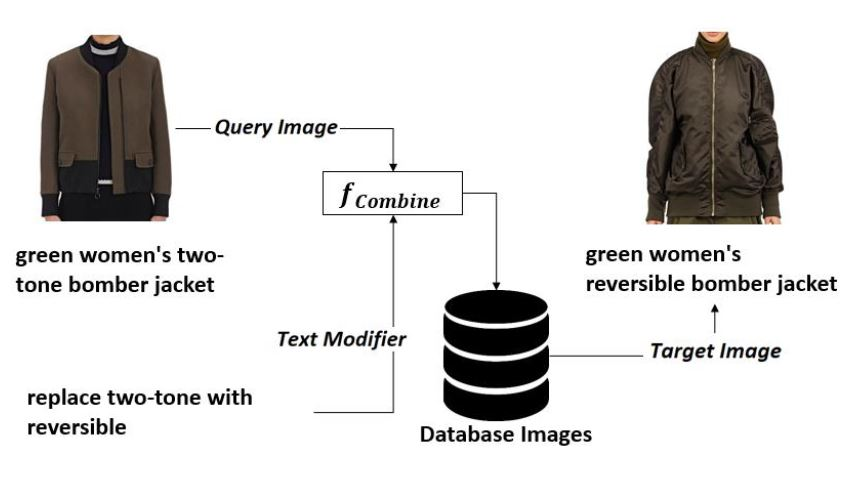
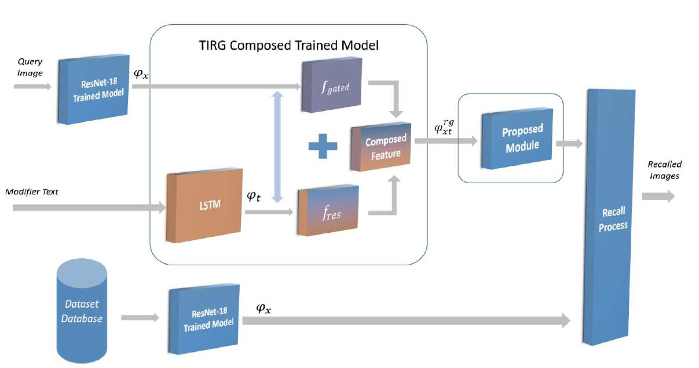
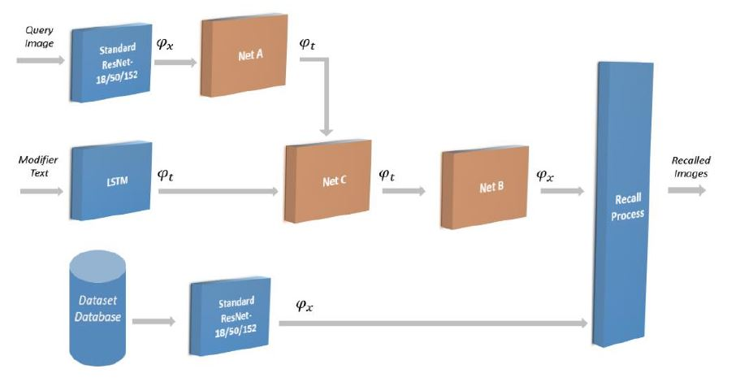

# Composing Text and Image for Image Retrieval


## This Project is influenced by the following Paper and Code:
  Paper:
  <br>
  **<a href="https://arxiv.org/abs/1812.07119">Composing Text and Image for Image Retrieval - An Empirical Odyssey</a>**
  <br>
  Nam Vo, Lu Jiang, Chen Sun, Kevin Murphy, Li-Jia Li, Li Fei-Fei, James Hays
  <br>
  CVPR 2019.

  Code
  <br>
  **<a href="https://github.com/google/tirg">GitHib Code</a>**

  ```
  @inproceedings{vo2019composing,
    title={Composing Text and Image for Image Retrieval-An Empirical Odyssey},
    author={Vo, Nam and Jiang, Lu and Sun, Chen and Murphy, Kevin and Li, Li-Jia and Fei-Fei, Li and Hays, James},
    booktitle={CVPR},
    year={2019}
  }
  ```

---------------------------------------------------------------------------------------
## Introduction



In this Project, our problem definition goes the same as computer vision in which we try to retrieve an images with a query image and modifier text which describes user modification on the query, we will try to solve this problem with three diffrent approches as descriped in the following Papers:

- Paper 1 : **<a href="BK/2021236923.pdf">This Link</a>** 
- Paper 2 : **<a href="BK/ANNPR2022_paper_0154.pdf">This Link</a>** 


Paper 1 OverView:
<br>


Paper 2 OverView:
<br>



## Setup

- torchvision
- pytorch
- numpy
- tqdm
- tensorboardX
- Anaconda
- VS Code


## How To Run:

- First Download File Folder From :**<a href="https://www.mediafire.com/file/544e4u46mcdf6oi/Files.rar/file">This Link</a>** 
- Optional* : Download the Fashion200k dataset from this [external website](https://github.com/xthan/fashion-200k) Download our generated test_queries.txt from [here](https://storage.googleapis.com/image_retrieval_css/test_queries.txt).
- Place Dataset inside File Folder (You may not need to download dataset beacuse features already extracted from images and saved in File Folder).
- Then Place File Folder at location you want put edit "Path1" attribute in code to this location.
- use the "Main.py" to run functions.


## Pretrained Models:

pretrained models already downloaded with the above folder, but you can use the Code in "ColabFiles" Folder to train them again.
*The numbers are slightly different from the ones reported in the paper due to the re-implementation.*


